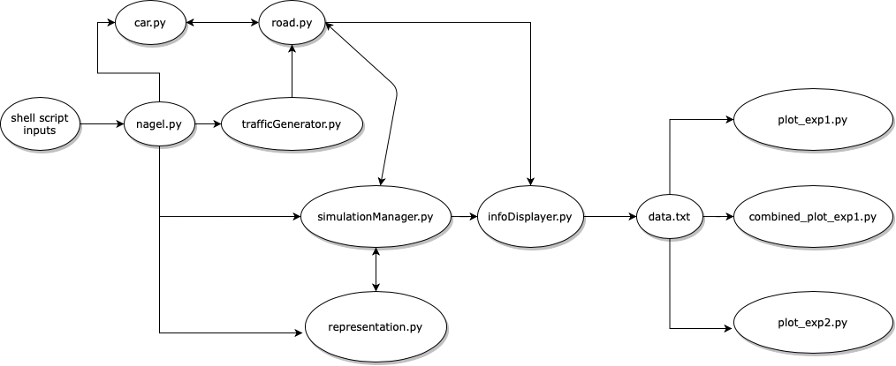

# NaSch_CA_Traffic_Flow_Analysis_Software

This repository contains software for multi-agent simulation model of mixed traffic flow of connected (HVs) and automated vehicles
(AVs) in Python using pygame, matplotlib, numpy, scipy and seaborn libraries. The software is capable of simulating many
different cases of traffic flow and creates data files and figures for the purpose of analysis. Currently I am working on
making the front end of the software more user friendly for potential commercialization.

## CA Traffic Analysis Software

A pygame, numpy and matplotlib based software that lets you create simulation of different traffic flow scenarios using
the concepts of Cellular Automata and perform data analysis and visualization.

### Purpose of software:

This software was designed under the supervision of Dr. Jia Li using inspiration from Nagel-Schrekenberg's Cellular Automata Rules for Traffic flow. The software can be used to simulate traffic for many different types of car and traffic situations and record all the important traffic-flow parameters and allows the user to track customized parameters as well. The software also comes with a data analysis and visualization package that helps the user make sense of the data.

### Current Version: 0.1

The current version of the software deals with simulating heterogeneous traffic flow of Autonomous Vehicles (AVs) and Human-driven Vehicles (HVs) on a three lane circular road. The software has three different models of AVs that is being used in two experiments in a research project led by Dr Li. The first experiment deals with analyzing the traffic flow of this heterogenous mix at three fixed densities: low, critical and high for the three different cases of AV models. The second experiment involves increasing the system density every N time steps till jam density is established and analyzing the fundamental diagram for the three different models. For the purpose of the research, the software looked heavily into self-organized clustering and lane formation phenomenon.

## Summary of Files and Directories
The following outlines all the relevant directories and files for the software.

**Base directory:** This is the folder where all the directories are found.
- nagel.py
 This code is the initiator of the entire software. It starts the simulation engine running on pygame and returns control to the rest of the program files.
- representation.py
This code is responsible for the visualization of the road, car, and information in the pygame window.
- infoDisplayer.py
This code takes data from the back end of the software and displays that information on the pygame window by sending that data to the representation.py file. It also records all the parameters of interest in the text files.
- plot_exp1.py
This code produces all the plots needed for experiment 1 from the raw data text file.
- plot_exp2.py
This code produces all the plots needed for experiment 2 from the raw data text file.
- combined_plot_exp1.py
This code makes plot that needs input from experiment 1 test cases using the raw text data files.
- simulationManager.py
This code is responsible for updating the traffic flow simulations. It constantly transfers control back and forth from the car.py, road.py, representation.py and infoDisplayer.py file.

**"config" directory:** This directory holds files in charge of road/traffic situations.
- case.py
This file describes the dimensions of the pygame window and the type of road/traffic condition to be simulated.

**Simulation directory:** This directory holds files that describe OOP code files.
- car.py
This code creates an object called car with certain properties and functions that describes the vehicles behavior.
- road.py
This code creates an object called road with certain properties and functions that describes the rules that vehicles interacting with the road should abide by.
- speedLimits.py
This code creates a provision to make traffic lights or damaged road conditions.
- trafficGenerators.py
This code decides how traffic is generated in the simulation.

**"draft_2" directory:** It contains all the raw data and results from the simulation experiments.

## Control Flow of The Program



## Installation
Install the following libraries for python.
```bash
pip install numpy
pip install matplotlib 
pip install pygame
```

## Usage
To simulate experiment 1: Heterogeneous Dynamics Under Constant Traffic Densities 
```bash
. execute_all_sim.sh
```
To simulate experiment 2: Equilibrium Relation and Dynamics Under Varying Traffic Densities
```bash
. fd_sim_all.sh
```
## Author Comments
This program is really specific to our research project and I don't believe the running mechanism for this current version should be included since the simulation framework is very precise to fit our needs. I highly recommend you check out this repository of mine - [Traffic Analysis and Simulation Software](https://github.com/shanto268/comprehensive_simulation_traffic_analysis_software) to use the framework of this software but for more customized needs.

## Project Poster
[Link to project poster](https://www.depts.ttu.edu/true/undergraduate-research-conference/2020/poster-files/poster_shanto.pdf)
